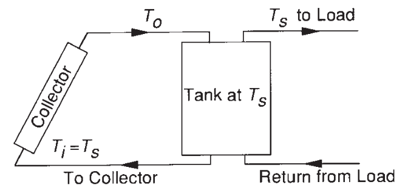
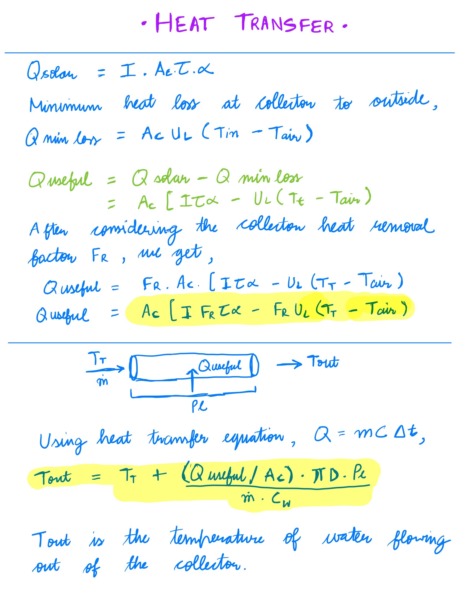
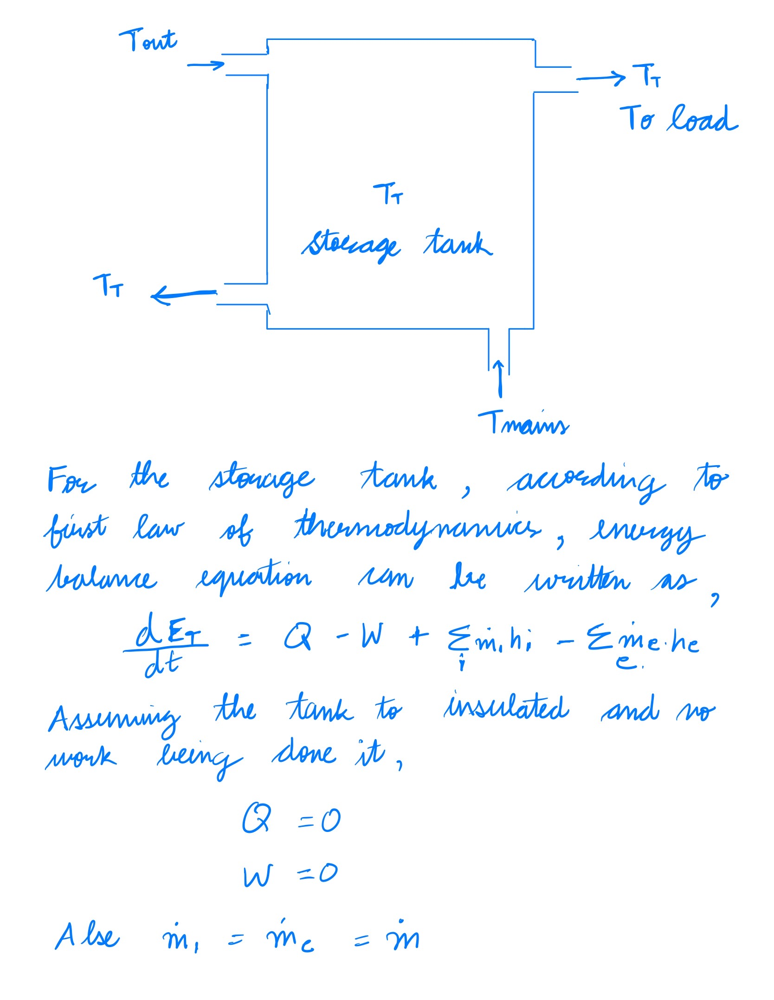
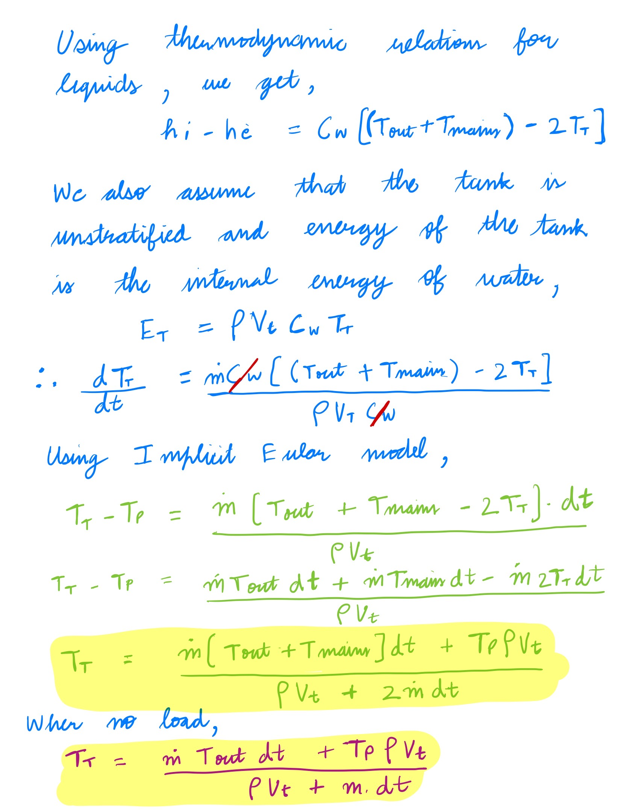

# Heat transfer

This application simulates heat transfer from a solar collector to a storage tank. This solar water heater is an <b>Open loop Active circulation</b> system meaning it heats the water which is circulated from tank to the collector using a pump.



## Getting Started

First, clone the repository and then run the following commands:

```bash
cd heat-transfer
npm install

# Run the development server
npm run dev
# or
# Run the build
npm run build
npm start
```

Open [http://localhost:3000](http://localhost:3000) with your browser to see the result.


> I developed this application with `node v20.12.0`. Incase, you are not able to start the development server or build the application, maybe install the said node version. Thanks :)

## Dataset

The dataset used in the application is collected for Salt Lake City from [National Solar Radiation Database](https://nsrdb.nrel.gov/). The dataset is located at [`app/data/dataset.json`](app/data/dataset.json).

Data structure and description -

```
{
  "year": 2022,
  "month": 6,
  "day": 1,
  "hour": 0,
  "minute": 0,
  "dhi": 0,
  "dni": 0,
  "ghi": 0,
  "temperature": 8
}
```

`ghi` : Modeled solar radiation on a horizontal surface received from the sky<br>
`dhi` : Modeled solar radiation on a horizontal surface received from the sky excluding the solar disk<br>
`dni` : Modeled solar radiation obtained from the direction of the sun

The data points are at a constant time step value of 10 minutes. It is assumed that the all the values are <b>averaged over last 10 minutes</b>.

> If you wish to simulate the system against dataset for any other date, just replace the [`dataset.json`](app/data/dataset.json) with your data. Just make sure, the data is formatted according to the above structure.<br>
> Current dataset is for `06/01/2022`.

## Simulation

The application comes with existing simulations which are saved in [`app/data/simulations.json`](app/data/simulations.json). You are also allowed to create simulations of your own but they <b>won't be saved</b>. If you wish to save your simulations, I would suggest adding the simulation parameters to the `simulations.json`.

The simulation library is located at [`app/simulation/simulation.js`](app/simulation/simulation.js). This file contains the main logic for calculating heat transfer from solar collector to the storage tank.

Use the [`heatTransfer`](https://github.com/itsiprikshit/heat-transfer/blob/1c3240f52266048c9e7eb9d609c659d3965f6206/app/simulation/simulation.js#L116) method to simulate the heat transfer.

Simulation parameters and their description -

```
{
    "id": 1,
    "toLoad": false,
    "Ac": 4,
    "FU": 3,
    "FTA": 0.7,
    "Pl": 4,
    "Pr": 0.04,
    "Tmains": 20,
    "m": 0.1,
    "Vt": 0.1,
    "Cw": 4182,
    "rho": 995,
    "ts": 600
}
```

`id` : Simulation id (Number) <br>
`toLoad` - Set to `true` if the water is being supplied to households and used, toLoad can be changed while the simulation is running (Boolean) <br>
`Tmains` - Temperature of cold water entering the tank through the main supply (Celcius) <br>
`Tair` - Air temperature (Celcius) <br>
`Ac` - Area of collector (m^2) <br>
`FU` - Product of collector heat removal factor and overall collector heat loss coefficient (W/m^2 C) <br>
`FTA` - Product of collector heat removal factor, transmittance and absorbance of collector (Constant) <br>
`m` - Mass flow rate of water (kg/s m^2) <br>
`Cw` - Specific heat capacity of water (J/kg C) <br>
`rho` - Density of water (kg/m^3) <br>
`Vt` - Volume of tank (m^3) <br>
`ts` - Time step (seconds) <br>
`Pl` - Length of pipe inside the collector (m) <br>
`Pr` - Radius of pipe (m) <br>

Since the existing dataset has data points 10 minutes, therefore, the default value of `ts` should be `600 seconds`.

> After you have finalized all the simulation parameters, you can `Run`, `Pause` and `Reset` the simulation.<br>
> You can also toggle the value of `toload` during the run which essentially sets whether the water is being used or not.

Naturally, when `toload` is false the temperature of tank water will be more than otherwise because the hot water does not leave the tank.

Other than the javascript implementation, I have also included the python implementation of the code of the heat transfer.
You can find it at [`python/`](./python/).<br> The folder contains a [`python notebook`](python/mysolar.ipynb) file and a [`python script`](python/mysolar.py).
Please note that the python code was implemented in Google colab. Therefore, I would recommend running the code in Google colab for avoid any hassles.

## Thermodynamics

Please checkout the images attached below to know more about the heat transfer logic.





> Some Assumptions -<br>
>
> -   The storage tank is fully insulated therefore, there is no heat loss from the tank to the surroundings<br>
> -   The tank is <b>unstratified storage tank</b> i.e. the contents of the tank are relatively uniform in temperature and composition throughout,
> -   No extra heat is applied to the tank<br>
> -   No work is being done on the tank<br>
> -   The external pipes are also insulated therefore, no heat loss

## Result

Based on the simulation I made following observations -

-   When the solar irradiance is 0 (happens during night), the temperature of tank water may or may not increase. It depends on the following factors:
    -   If `Tair > Twater`, the temperature of tank water increases because heat is transferred from air to the water
    -   However, if the `Tair < Twater`, heat is transferred from water to the surrounding air at collector, thus decreasing the temperature of tank water
-   When the solar irradiance increases, the temperature within the tank may or may not increase. It depends on the following factors:
    -   If the tank water is not going out to load and is only circulating within the tank and the collector, the temperature of tank water increases somewhat proportionally to solar irradiance
    -   However, if the water is being used at load, the temperature of tank water does not increase that much because there is a constant supply of cold water from the mains
